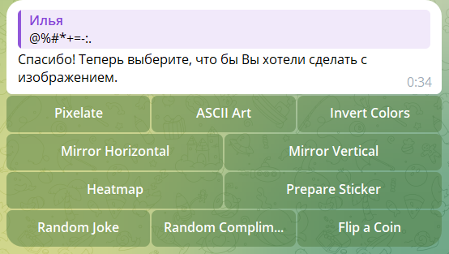
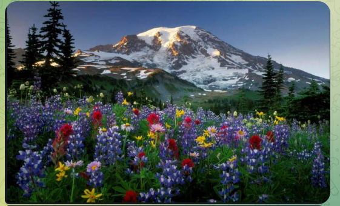
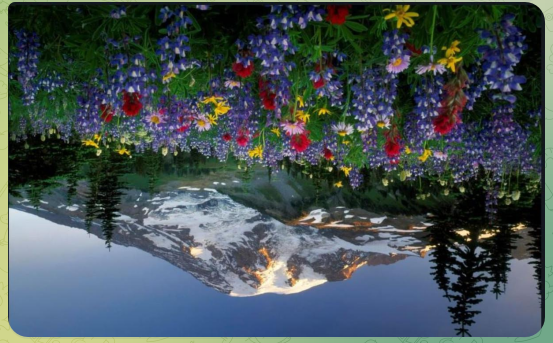
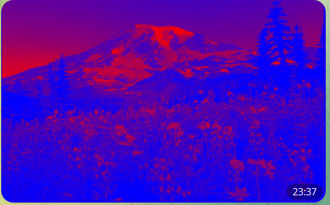

Многофункциональный телеграм-бот. Данный бот сейчас умеет обрабатывать фотографии и делать ASCII-арт 
=====================================================================================
## Проект использует библиотеки telebot (для взаимодействия с Telegram API) и Pillow (для работы с изображениями) 

### Импорты и настройки:
* import io: импортирует модуль io, который обеспечивает возможность работы с потоками. Он используется здесь
для обработки операций с файлами в памяти, таких как чтение и запись данных изображений;
* import os: взаимодействие с операционной системой. В данном проекте используется для получения значения
токена бота из переменной окружения;
* import telebot: импортирует библиотеку telebot, которая используется для взаимодействия с API Telegram Bot.
Позволяет создавать ботов, которые могут отправлять и получать сообщения, обрабатывать команды и многое другое;
* from PIL import Image: импортирует модуль Image из библиотеки Pillow. Этот модуль используется для открытия,
обработки и сохранения изображений в различных форматах;
* from PIL import ImageOps: импорт модуля ImageOps из библиотеки Pillow. Включает в себя различные операции,
такие как инверсия цветов, поворот и обрезка изображений и др.;
* from dotenv import load_dotenv: библиотека dotenv используется для загрузки переменных окружения из файла .env
В проекте load_dotenv вызывается для загрузки переменной TELEGRAM_BOT_TOKEN из файла .env,
чтобы обеспечить безопасность токена бота;
* from telebot import types: импортирует модуль types из библиотеки telebot, который содержит различные классы
и функции для создания различных типов объектов Telegram, таких, как клавиатуры и кнопки.

------------
## Структура программы

### Функции обработки изображений:
- resize_image: изменяет размер изображения с сохранением пропорций.
- grayify: преобразует цветное изображение в оттенки серого.
- image_to_ascii: основная функция для преобразования изображения в ASCII-арт. Изменяет размер, преобразует в градации серого и затем в строку ASCII-символов.
- pixels_to_ascii: конвертирует пиксели изображения в градациях серого в строку ASCII-символов, используя предопределенную строку ASCII_CHARS.
- pixelate_image: принимает изображение и размер пикселя. Уменьшает изображение до размера, где один пиксель представляет большую область, затем увеличивает обратно, создавая пиксельный эффект.
- invert_colors: функция инверсии цветов изображения
- mirror_image: функция отражения изображения по горизонтали или вертикали
- convert_to_heatmap: функция преобразования изображения в тепловую карту

### Обработчики событий:
- @bot.message_handler(commands=['start', 'help']): для текстовых команд. Реагирует на команды /start и /help, отправляя приветственное сообщение.
- @bot.message_handler(content_types=['photo']): для получения изображений. Реагирует на изображения, отправляемые пользователем, и предлагает варианты обработки.
- @bot.callback_query_handler: (func=lambda call: True): определяет действия в ответ на выбор пользователя (например, пикселизация или ASCII-арт) и вызывает соответствующую функцию обработки. 

### Функции отправки изображений:
- pixelate_and_send: пикселизирует изображение и отправляет его обратно пользователю
- ascii_and_send: преобразует изображение в ASCII-арт и отправляет результат в виде текстового сообщения
- invert_and_send: инверсия цветов 
- mirror_and_send: отражение изображения
- heatmap_and_send(message): преобразование изображения в тепловую карту.

### Инициализация бота:
- bot.polling(none_stop=True).

--------------
### Скриншоты работы программы:
#### Запуск телеграмм-бота

#### Запрос изображения от пользователя

#### Изображение загружено

#### Запрос способа обработки изображения 
(пикселизация, преобразование в ASCII-арт, инверсия, отражение по горизонтали или вертикали, создание тепловой карты)

#### Пример пикселизации

#### Пример преобразования того же объекта в ASCII-арт

#### Пример инверсии (создание "негатива" изображения)

#### Пример отражения по горизонтали 

#### Пример отражения по вертикали 

#### Пример преобразования изображения в тепловую карту 

